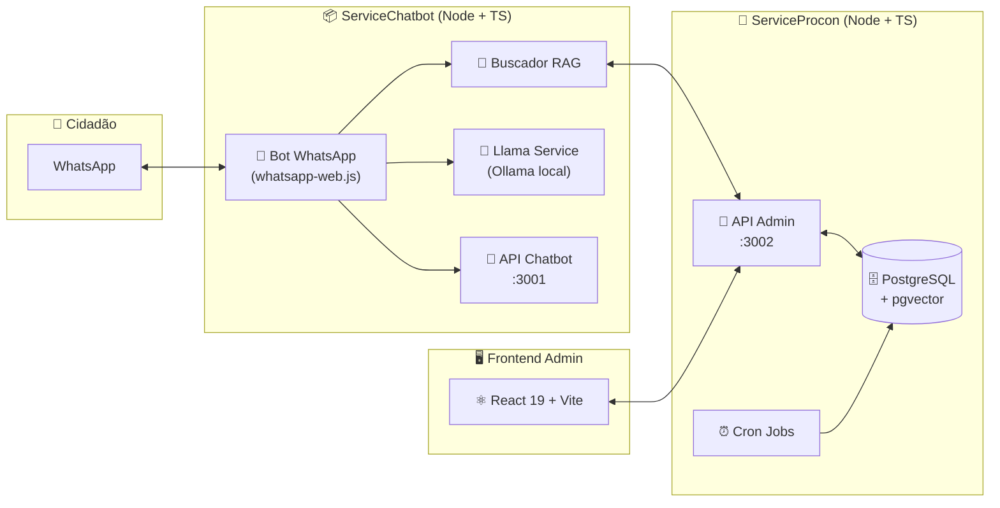

<div id="top"></div>

<h1 align="center">🤖 ProconChatBot</h1>
<h3 align="center">Atendimento inteligente ao consumidor via WhatsApp — PROCON Jacareí/SP</h3>

<p align="center">
  
  
  
  
</p>

<p align="center">
  
  
  
  
  
  
  
</p>

<p align="center">
  <a href="#-sobre-o-projeto">Sobre</a> ·
  <a href="#-desafio-acadêmico">Desafio</a> ·
  <a href="#-arquitetura">Arquitetura</a> ·
  <a href="#-stack-tecnológica">Stack</a> ·
  <a href="#-estrutura-do-repositório">Estrutura</a> ·
  <a href="#-quick-start">Quick Start</a> ·
  <a href="#-documentação-detalhada">Docs</a> ·
  <a href="#-equipe">Equipe</a> ·
  <a href="#-sprints">Sprints</a>
</p>


<br>

---

<br>

## 📖 Sobre o Projeto

O **ProconChatBot** é um sistema de atendimento automatizado desenvolvido em parceria com a **Fundação de Proteção e Defesa do Consumidor de Jacareí-SP (PROCON Jacareí)**. A solução integra um **chatbot inteligente via WhatsApp** a um **painel administrativo web** para que cidadãos tenham acesso rápido a orientações sobre direitos do consumidor — sem precisar se deslocar até a unidade física.

> 💡 O sistema **não substitui** o atendimento jurídico ou administrativo formal: atua como um canal inicial de orientação, alinhado às diretrizes do PROCON e à Lei Geral de Proteção de Dados (LGPD).

### ✨ Principais Funcionalidades

- 🤖 **Chatbot via WhatsApp** com fluxo guiado de atendimento (menu interativo).
- 🧠 **Motor RAG** (Retrieval-Augmented Generation) para busca semântica em base jurídica.
- 🦙 **LLM local (Ollama / Llama 3.2)** para enriquecimento textual de respostas — 100% offline, sem custo de API.
- 📅 **Agendamentos presenciais** diretamente pelo WhatsApp, com validação de feriados e horários.
- 🏢 **Painel administrativo** (React 19 + Vite) com RBAC (Funcionário, Coordenador, Diretor, Dev).
- 📝 **Auditoria completa** de operações com `audit_log` e moderação de perguntas.
- 🌎 **Multi-unidade**: o sistema é preparado para atender múltiplos PROCONs identificados pelo número do WhatsApp.

🔝 [Voltar ao topo](#top)


<br>

---

<br>

## 🎯 Desafio Acadêmico

| Item | Detalhe |
|---|---|
| **Parceiro** | PROCON — Fundação de Proteção e Defesa do Consumidor de Jacareí-SP |
| **Contato** | Renan de Oliveira Corrêa *(Diretor de Assuntos da Cidadania)* |
| **Curso** | 6º semestre — DSM *(Desenvolvimento de Software Multiplataforma)* |
| **Focal Point** | Prof. Marcelo Augusto Sudo |
| **Kick-off** | 09/02/2026 às 19h00 |
| **Tema** | Chatbot para Orientação ao Consumidor via WhatsApp |

### 🧩 Problema

O atendimento humano do PROCON Jacareí é frequentemente sobrecarregado por demandas repetitivas: dúvidas sobre prazos, documentos necessários, procedimentos e encaminhamentos. Grande parte dessas demandas segue **fluxos decisórios bem definidos** com base em normas legais. O objetivo do projeto é **automatizar essa triagem inicial** para liberar a equipe humana para os casos que realmente exigem intervenção especializada.

### 📋 Requisitos atendidos

<details>
<summary><b>Requisitos Funcionais</b></summary>

- ✅ **RF01** — Interação via WhatsApp como interface principal.
- ✅ **RF02** — Chatbot com tabela de decisões guiando a conversa.
- ✅ **RF03** — Navegação por fluxos decisórios sequenciais.
- ✅ **RF04** — Resposta orientadora consolidada ao final do fluxo.
- ✅ **RF05** — Complemento via LLM (somente geração textual).
- ✅ **RF06** — Registro de interações para análise.

</details>

<details>
<summary><b>Requisitos Não Funcionais</b></summary>

- ✅ **RNF01** — Linguagem clara e acessível.
- ✅ **RNF02** — Tempo de resposta adequado em tempo real.
- ✅ **RNF03** — Respeito à LGPD.
- ✅ **RNF04** — Caráter orientativo explícito.
- ✅ **RNF05** — Identificação transparente de respostas com IA.
- ✅ **RNF06** — Práticas modernas: agile, versionamento, testes e documentação.

</details>

<details>
<summary><b>Restrições de Projeto</b></summary>

- ✅ **RP01** — Integração com WhatsApp via `whatsapp-web.js` *(alternativa gratuita à Cloud API, mantendo o modelo conceitual)*.
- ✅ **RP02** — Backend em Node.js + TypeScript.
- ✅ **RP03** — Estrutura modular: chatbot, gestão de fluxos e LLM separados.
- ✅ **RP04** — Escopo compatível com o cronograma do semestre.

</details>

🔝 [Voltar ao topo](#top)


<br>

---

<br>

## 🏗️ Arquitetura

O projeto adota uma arquitetura **dual-service**, separando claramente o canal de atendimento do consumidor (WhatsApp) das operações administrativas internas do PROCON.



### Camadas principais

| Componente | Responsabilidade | Porta |
|---|---|---|
| **ServiceChatbot — Bot WhatsApp** | Recebe mensagens, mantém sessão, roteia para RAG ou LLM. | — |
| **ServiceChatbot — RAG API** | Busca semântica em base local + integração com LLM. | `3000` |
| **ServiceChatbot — Chatbot API** | Endpoints para integração externa com o chatbot. | `3001` |
| **ServiceProcon — Admin API** | CRUDs, autenticação JWT, auditoria, agendamentos. | `3002` |
| **ServiceProcon — Frontend** | Painel administrativo React 19 com RBAC. | `5173` *(Vite dev)* |
| **PostgreSQL + pgvector** | Persistência relacional + busca vetorial para RAG. | `5432` |
| **Ollama (Llama 3.2)** | LLM local para geração textual. | `11434` |

> 📐 **Detalhamento completo**, fluxos de dados e padrão MVC com Active Record: [docs/ARCHITECTURE.md](./docs/ARCHITECTURE.md).

🔝 [Voltar ao topo](#top)


<br>

---

<br>

## 🛠️ Stack Tecnológica

### Backend

| Categoria | Tecnologia | Onde é usada |
|---|---|---|
| **Linguagem** | TypeScript 5+ / 6 | Ambos serviços |
| **Runtime** | Node.js 18+ | Ambos serviços |
| **Framework Web** | Express 4 / 5 | ServiceProcon, ServiceChatbot |
| **ORM** | Prisma 6/7 | ServiceProcon |
| **Banco de Dados** | PostgreSQL 18 + `pgvector` | Persistência + busca vetorial |
| **Autenticação** | JWT (`jsonwebtoken`) + `bcrypt` | ServiceProcon |
| **Cron Jobs** | `node-cron` | Atualização de agendamentos |
| **WhatsApp** | `whatsapp-web.js` + `qrcode-terminal` | ServiceChatbot |
| **Busca / NLP** | `fuse.js` + `natural` (stemming PT-BR) | ServiceChatbot — RAG |
| **LLM Local** | Ollama + Llama 3.2 / TinyLlama | ServiceChatbot |
| **HTTP Client** | `axios` | Comunicação entre serviços |
| **Calendário** | `ical-generator` | Envio de `.ics` por WhatsApp |

### Frontend

| Categoria | Tecnologia |
|---|---|
| **Framework** | React 19 |
| **Build Tool** | Vite 8 |
| **Linguagem** | TypeScript 6 |
| **Roteamento** | React Router DOM 7 |
| **Alertas** | SweetAlert2 |
| **Linting** | ESLint 10 + typescript-eslint 8 |

### Testes & DevOps

| Categoria | Tecnologia |
|---|---|
| **Testes** | `node:test` nativo + `supertest` |
| **Execução TS** | `tsx`, `ts-node`, `nodemon` |
| **Versionamento** | Git + GitHub |
| **Workflow** | GitHub Issues + Projects + Branches por feature |

🔝 [Voltar ao topo](#top)


<br>

---

<br>

## 📂 Estrutura do Repositório

```text
ProconChatBot/
├── ServiceChatbot/              📦 Serviço de chatbot (WhatsApp + RAG + LLM)
│   └── backend/
│       ├── src/
│       │   ├── cli/             # CLI interativo para testes
│       │   ├── controllers/     # Controladores REST (RAG, chatbot)
│       │   ├── middlewares/     # Logger
│       │   ├── routes/          # Rotas Express (3000 RAG, 3001 chatbot)
│       │   ├── services/        # buscador, chatbot, llama, ics
│       │   ├── types/           # Tipagens compartilhadas
│       │   ├── whatsapp/        # Bot whatsapp-web.js + sessões
│       │   ├── __tests__/       # Testes (buscador + llama)
│       │   └── server.ts        # Ponto de entrada
│       └── package.json
│
├── ServiceProcon/               🏢 Serviço administrativo (API + Frontend)
│   ├── backend/
│   │   ├── prisma/
│   │   │   ├── schema.prisma    # Modelo de dados (7 tabelas)
│   │   │   └── migrations/
│   │   ├── src/
│   │   │   ├── config/          # database.ts (Prisma Client)
│   │   │   ├── controller/      # 7 controllers (usuario, procon, etc)
│   │   │   ├── jobs/            # Cron de atualização de status
│   │   │   ├── middleware/      # AuthMiddleware (JWT) + error
│   │   │   ├── model/           # Camada de acesso a dados
│   │   │   ├── routes/          # Rotas REST modulares
│   │   │   ├── service/         # Regras de negócio
│   │   │   ├── types/           # Tipagens
│   │   │   ├── __tests__/       # Testes por domínio
│   │   │   └── server.ts        # API admin na porta 3002
│   │   └── package.json
│   │
│   └── frontend/                ⚛️ Painel administrativo React 19
│       ├── public/              # favicon + ícones SVG
│       └── src/
│           ├── assets/
│           ├── components/      # Login, Dashboard, Users, Feriados, Agendamentos…
│           ├── context/         # AuthContext
│           ├── hooks/           # usePermissions, useToast
│           ├── services/api/    # Cliente HTTP por domínio
│           ├── types/           # roles + modules (RBAC client-side)
│           ├── utils/           # alert.ts (SweetAlert2)
│           ├── App.tsx
│           └── main.tsx
│
├── docs/                        📚 Documentação técnica
│   ├── ARCHITECTURE.md          # ✨ NOVO — arquitetura detalhada
│   ├── INSTALLATION.md          # ✨ NOVO — guia de setup completo
│   ├── API.md                   # ✨ NOVO — referência de endpoints
│   ├── FRONTEND.md              # ✨ NOVO — frontend React
│   ├── WHATSAPP.md              # ✨ NOVO — fluxo do chatbot
│   ├── RAG.md                   # Sistema RAG
│   ├── schema.md                # Dicionário de dados
│   ├── db.md                    # Decisão tecnológica + ADRs
│   ├── backend.md               # Backend (legado, referência)
│   ├── sprint1.md               # Relatório Sprint 01
│   └── sprint2.md               # Relatório Sprint 02
│
├── documentation/
│   └── product_backlog_procon_chatbot.md   # 7 épicos + 26 user stories
│
└── README.md                    # 📍 Você está aqui (documento central)
```

🔝 [Voltar ao topo](#top)


<br>

---

<br>

## 🚀 Quick Start

Setup rápido para colocar o projeto rodando localmente. Para o passo a passo detalhado *(variáveis de ambiente, banco com pgvector, Ollama, troubleshooting)*, veja [docs/INSTALLATION.md](./docs/INSTALLATION.md).

### Pré-requisitos

```bash
node --version    # >= 18
npm --version     # >= 9
docker --version  # opcional, mas recomendado para o banco
ollama --version  # opcional, para LLM local
```

### 1️⃣ Clonar e instalar

```bash
git clone https://github.com/cGuilhermec/ProconChatBot.git
cd ProconChatBot

# Backend administrativo
cd ServiceProcon/backend && npm install && cd ../..

# Backend chatbot
cd ServiceChatbot/backend && npm install && cd ../..

# Frontend
cd ServiceProcon/frontend && npm install && cd ../..
```

### 2️⃣ Subir o banco *(Docker)*

> ⚠️ Use credenciais próprias para dev local. Em produção, gere senhas fortes e nunca exponha a porta `5432`.

```bash
docker run -d --name postgres-procon \
  -e POSTGRES_USER=<seu_usuario_dev> \
  -e POSTGRES_PASSWORD=<sua_senha_dev> \
  -e POSTGRES_DB=<seu_db_dev> \
  -p 5432:5432 \
  ankane/pgvector:latest
```

### 3️⃣ Configurar `.env` *(ServiceProcon/backend)*

Gere um `JWT_SECRET` aleatório antes de criar o arquivo:

```bash
openssl rand -base64 48
```

```env
DATABASE_URL="postgresql://<seu_usuario_dev>:<sua_senha_dev>@localhost:5432/<seu_db_dev>"
JWT_SECRET="<cole-aqui-o-output-do-openssl>"
```

> 🔐 `.env` **não pode** ser commitado. Já está no `.gitignore`. Veja [docs/INSTALLATION.md](./docs/INSTALLATION.md) para detalhes de configuração segura.

### 4️⃣ Migrar o banco

```bash
cd ServiceProcon/backend
npx prisma migrate dev
```

### 5️⃣ Rodar os 3 processos *(abra 3 terminais)*

```bash
# Terminal 1 — API administrativa  (:3002)
cd ServiceProcon/backend && npm run dev

# Terminal 2 — Chatbot + RAG       (:3000 e :3001)
cd ServiceChatbot/backend && npm run dev

# Terminal 3 — Frontend admin       (:5173)
cd ServiceProcon/frontend && npm run dev
```

Ao iniciar o ServiceChatbot pela primeira vez, escaneie o **QR Code** no terminal com seu WhatsApp.

🔝 [Voltar ao topo](#top)


<br>

---

<br>

## 📚 Documentação Detalhada

Esta é a documentação central. Para tópicos específicos, navegue pelos documentos abaixo:

<table>
<tr>
<td width="50%">

### 🏗️ Arquitetura & Design

- 📐 [Arquitetura geral](./docs/ARCHITECTURE.md) — Visão dos dois serviços, fluxo de dados, ADRs.
- 🗄️ [Modelagem do banco](./docs/schema.md) — Dicionário de dados, índices, diagrama ER.
- 💡 [Decisão tecnológica do banco](./docs/db.md) — Por que PostgreSQL + pgvector + Prisma.

### 🧠 Inteligência Artificial

- 🔍 [Sistema RAG](./docs/RAG.md) — Busca semântica, stemming, Fuse.js, score de confiança.
- 💬 [Fluxo do Chatbot WhatsApp](./docs/WHATSAPP.md) — Estados de sessão, menu, agendamentos.

</td>
<td width="50%">

### 🛠️ Setup & Operação

- ⚙️ [Guia de instalação completo](./docs/INSTALLATION.md) — Passo a passo com troubleshooting.
- 🔌 [Referência de API](./docs/API.md) — Todos os endpoints das 3 APIs.
- ⚛️ [Frontend React](./docs/FRONTEND.md) — Componentes, rotas, RBAC, hooks.

### 📅 Gestão do Projeto

- 📋 [Product Backlog](./documentation/product_backlog_procon_chatbot.md) — 7 épicos, 26 user stories.
- 🏁 [**Sprint 01 — Relatório completo**](./docs/sprint1.md) — Core engine RAG *(09/03 – 25/03/2026)*.
- 🏁 [**Sprint 02 — Relatório completo**](./docs/sprint2.md) — Estruturação + 7 CRUDs *(13/04 – 29/04/2026)*.

</td>
</tr>
</table>

🔝 [Voltar ao topo](#top)


<br>

---

<br>

## 📅 Sprints

| Sprint | Período | Status | Foco | Relatório |
|:---:|:---:|:---:|:---|:---:|
| **1** | 09/03/2026 – 25/03/2026 |  | Motor RAG + LLM | [Ver relatório](./docs/sprint1.md) |
| **2** | 13/04/2026 – 29/04/2026 |  | Estruturação + 7 CRUDs | [Ver relatório](./docs/sprint2.md) |
| **3** | a definir |  | Integração final + entrega | — |

🔝 [Voltar ao topo](#top)


<br>

---

<br>

## 👥 Equipe

| Integrante | Papel |
|:---|:---:|
| **Jackson Rodrigo Costa Machado** | Scrum Master / Dev |
| **Ligia Ribeiro** | Product Owner |
| **Guilherme Carvalho** | Dev Team |
| **Gustavo Carvalho** | Dev Team |

🔝 [Voltar ao topo](#top)


<br>

---

<br>

## 📜 Convenções

### Branches

```text
feature/...        # Nova funcionalidade
fix/...            # Correção de bug
refactor/...       # Refatoração sem mudança de comportamento
documentation/...  # Documentação
```

### Commits *(Conventional Commits adaptado)*

```text
feat:      nova funcionalidade
fix:       correção de bug
docs:      mudança de documentação
refactor:  refatoração
test:      adição/ajuste de testes
chore:     manutenção (deps, config, build)
```

### Code Style

- **TypeScript estrito** em todo o projeto.
- **ESLint** no frontend; `tsc --noEmit` para checagem de tipos no backend.
- **MVC com Active Record** *(Controller → Service → Model → Prisma)* — veja [docs/ARCHITECTURE.md](./docs/ARCHITECTURE.md).

🔝 [Voltar ao topo](#top)


<br>

---

<br>

## ⚖️ Avisos Legais

> ⚠️ **Caráter orientativo.** As respostas fornecidas pelo chatbot **não substituem** o atendimento jurídico ou administrativo formal do PROCON. Trata-se de um canal inicial de orientação ao consumidor.

> 🤖 **Transparência de IA.** Respostas geradas com auxílio de modelos de linguagem (LLM) são identificadas como tal, conforme o RNF05.

> 🔒 **LGPD.** Dados pessoais coletados durante o atendimento são tratados conforme a Lei nº 13.709/2018.

---

<p align="center">
  <sub>Desenvolvido pela equipe <b>Azimuth</b> do <b>6º DSM da Fatec</b> em parceria com o <b>PROCON Jacareí/SP</b> — 2026.</sub>
</p>

<p align="center">
  <a href="#top">⬆ Voltar ao topo</a>
</p>
