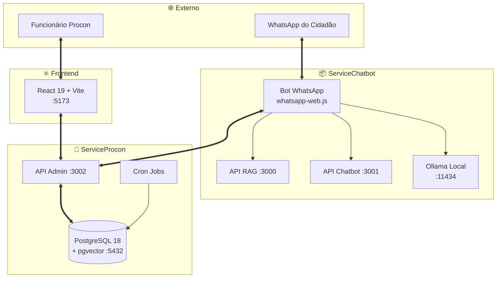
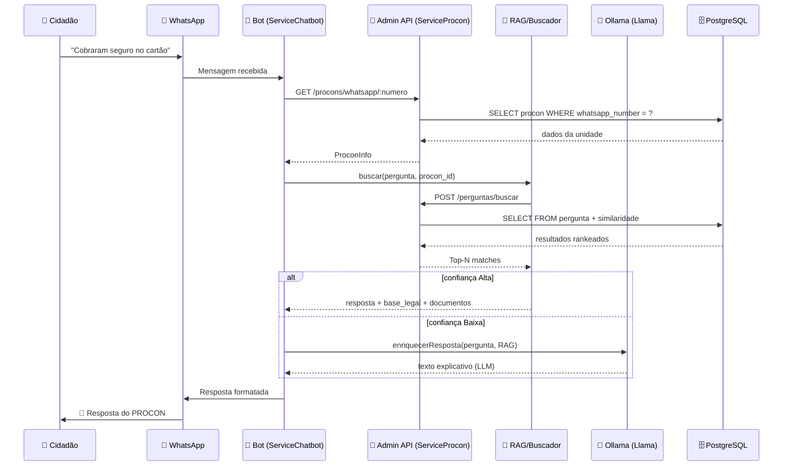
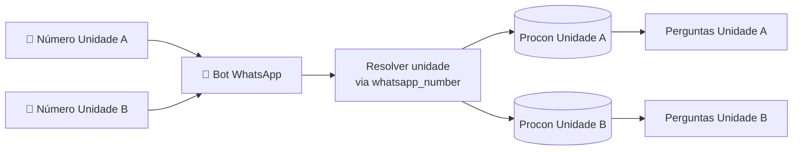
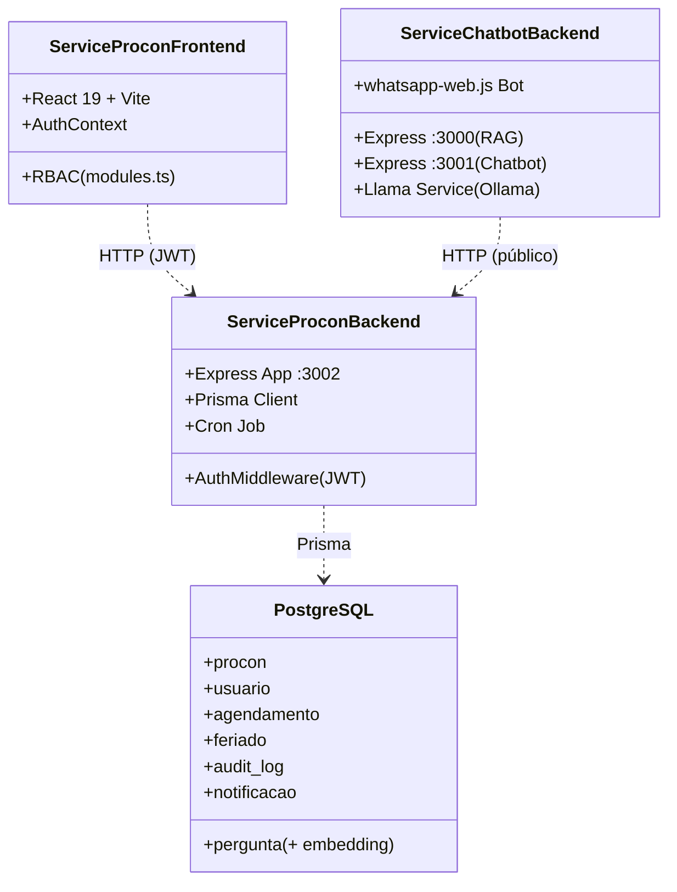

# 🏗️ Arquitetura do ProconChatBot

> Documento técnico que detalha a arquitetura **dual-service** do ProconChatBot, os fluxos de comunicação entre os componentes, os padrões adotados e as decisões arquiteturais registradas (ADRs).

🏠 [Voltar ao README](../README.md)


<br>

---

<br>

## 📋 Índice

- [Visão geral](#-visão-geral)
- [Componentes do sistema](#-componentes-do-sistema)
- [Fluxo de uma mensagem (end-to-end)](#-fluxo-de-uma-mensagem-end-to-end)
- [Padrão MVC com Active Record](#-padrão-mvc-com-active-record)
- [Comunicação entre serviços](#-comunicação-entre-serviços)
- [Multi-tenancy (multi-unidade)](#-multi-tenancy-multi-unidade)
- [Segurança](#-segurança)
- [Jobs assíncronos](#-jobs-assíncronos)
- [Decisões arquiteturais (ADRs)](#-decisões-arquiteturais-adrs)
- [Diagrama de pacotes](#-diagrama-de-pacotes)


<br>

---

<br>

## 🎯 Visão geral

O ProconChatBot é composto por **dois serviços backend independentes** + **um frontend web**, comunicando-se por **HTTP REST** e compartilhando o mesmo banco PostgreSQL para o ServiceProcon. Esta separação permite:

- ✅ **Isolamento de responsabilidades:** o WhatsApp pode cair sem afetar o painel administrativo.
- ✅ **Escalabilidade independente:** o serviço de chatbot escala conforme volume de mensagens; o admin escala conforme uso interno.
- ✅ **Stack focada:** cada serviço tem suas dependências (whatsapp-web.js só no chatbot; Prisma só no admin).
- ✅ **Multi-tenant:** um único deployment pode atender múltiplas unidades PROCON identificadas pelo número do WhatsApp.



🔝 [Voltar ao topo](#-arquitetura-do-proconchatbot)


<br>

---

<br>

## 🧱 Componentes do sistema

### ServiceProcon *(backend administrativo + frontend)*

| Componente | Tecnologia | Responsabilidade |
|---|---|---|
| **API Admin** *(`:3002`)* | Express 5 + Prisma 6 + JWT | CRUD de Procon, Usuario, Pergunta, Feriado, Agendamento; autenticação; auditoria. |
| **Jobs (Cron)** | `node-cron` | Atualização diária de status de agendamentos *(à meia-noite)*. |
| **Banco** *(`:5432`)* | PostgreSQL 18 + `pgvector` | Persistência de todas as entidades + embeddings RAG. |
| **Frontend** *(`:5173` dev)* | React 19 + Vite 8 + React Router 7 | Painel administrativo com RBAC (Funcionario, Coordenador, Diretor, Dev). |

### ServiceChatbot *(canal de atendimento)*

| Componente | Tecnologia | Responsabilidade |
|---|---|---|
| **Bot WhatsApp** | `whatsapp-web.js` + `qrcode-terminal` | Recebe mensagens, mantém sessões em memória, roteia para fluxos. |
| **API RAG** *(`:3000`)* | Express + Fuse.js + Natural | Endpoints técnicos para busca semântica. |
| **API Chatbot** *(`:3001`)* | Express | Endpoints REST para integração externa com o chatbot. |
| **LLM Service** | `axios` → Ollama (Llama 3.2 / TinyLlama) | Enriquecimento textual + saudações + casos sensíveis. |
| **ICS Service** | `ical-generator` | Gera arquivo `.ics` de calendário e envia ao usuário. |
| **Buscador** | `fuse.js` + acesso à API Admin | Consulta a tabela `pergunta` via `/perguntas/buscar`. |

🔝 [Voltar ao topo](#-arquitetura-do-proconchatbot)


<br>

---

<br>

## 🔄 Fluxo de uma mensagem (end-to-end)

A jornada típica de um cidadão consultando o chatbot:



### Etapas detalhadas

1. **Recepção** — `whatsapp-web.js` dispara o evento `message` no [bot.ts](../ServiceChatbot/backend/src/whatsapp/bot.ts).
2. **Identificação da unidade** — O bot resolve qual unidade PROCON via `whatsapp_number` único.
3. **Sessão** — Estado da conversa mantido em memória (`Map<chatId, Session>`) com `SessionStep` *(MENU_PRINCIPAL, AGUARDANDO_CPF, SELECIONANDO_DATA…)*.
4. **Roteamento**:
   - Saudações, agradecimentos e casos sensíveis *(violência, saúde mental)* → respostas determinísticas no `llama.service.ts`.
   - Comandos de menu *("ajuda", números) → fluxos hard-coded.
   - Pergunta livre → `BuscadorProcon.buscar()` consulta o RAG no banco.
5. **Resposta** — Formatada em Markdown do WhatsApp com `*negrito*`, emojis e quebras claras.
6. **Persistência** *(opcional)* — Agendamentos e logs são gravados via Admin API.

🔝 [Voltar ao topo](#-arquitetura-do-proconchatbot)


<br>

---

<br>

## 🧩 Padrão MVC com Active Record

Adotamos **MVC com camada de Model ativa** *([ADR-001](#adr-001--arquitetura-em-camadas))* no ServiceProcon:

```text
HTTP Request
    │
    ▼
┌──────────────────┐
│   Controller     │   Orquestração HTTP. Recebe, valida formato, formata resposta.
│                  │   ❌ Não contém regras de negócio.
└────────┬─────────┘
         │
         ▼
┌──────────────────┐
│    Service       │   Regras de negócio, validações, orquestração de Models.
│                  │   ❌ Não acessa o banco diretamente.
└────────┬─────────┘
         │
         ▼
┌──────────────────┐
│     Model        │   Única camada que toca o Prisma Client.
│   (Prisma)       │   ❌ Não contém regras de negócio.
└────────┬─────────┘
         │
         ▼
   PostgreSQL
```

### Responsabilidades por camada

| Camada | Faz | Não faz |
|---|---|---|
| **Controller** | Recebe req/res, valida payload básico, retorna HTTP code adequado. | Lógica de negócio, acesso direto a DB. |
| **Service** | Regras de negócio, integrações externas, transações, validações de domínio. | Acesso direto ao banco de dados. |
| **Model** | Operações Prisma (`findUnique`, `create`, `update`, raw queries). | Decisões de negócio. |

📁 Reflexo no código:

```text
ServiceProcon/backend/src/
├── controller/     ← Camada Controller
├── service/        ← Camada Service
├── model/          ← Camada Model (Prisma)
├── routes/         ← Express routes
├── middleware/     ← Auth, error handling
├── config/         ← Prisma client, env
└── jobs/           ← Cron tasks
```

🔝 [Voltar ao topo](#-arquitetura-do-proconchatbot)


<br>

---

<br>

## 🔗 Comunicação entre serviços

O **ServiceChatbot** age como cliente HTTP do **ServiceProcon** para acesso aos dados. Não há banco compartilhado entre os processos — apenas a Admin API expõe os dados.

| Endpoint chamado | Quando | Autenticação |
|---|---|---|
| `GET /procons/whatsapp/:numero` | Identificar unidade pelo número do WhatsApp | ❌ Público |
| `POST /perguntas/buscar` | Consultar base RAG | ❌ Público *(RP01: chamada interna)* |
| `GET /agendamento/dias-disponiveis` | Listar datas livres | ❌ Público |
| `GET /agendamento/horarios-disponiveis` | Horários do dia escolhido | ❌ Público |
| `POST /agendamento` | Confirmar agendamento | ❌ Público |
| `GET /agendamento/buscar-por-cpf` | Consulta de agendamentos | ❌ Público |
| `DELETE /agendamento/:id` | Cancelamento | ❌ Público |

> 📌 Em produção, restringir essas rotas "públicas" por **firewall/network policy** ou adicionar um token compartilhado entre serviços.

🔝 [Voltar ao topo](#-arquitetura-do-proconchatbot)


<br>

---

<br>

## 🌎 Multi-tenancy (multi-unidade)

O sistema é preparado para **múltiplas unidades PROCON** convivendo num único deployment:

- A tabela `procon` armazena cada unidade com seu próprio `whatsapp_number` único.
- Quando uma mensagem chega no bot, o ServiceChatbot resolve a unidade via `whatsapp_number`.
- Todas as queries de `pergunta`, `agendamento` e `feriado` são filtradas por `procon_id`.
- Usuários administrativos têm `procon_id` vinculado, escopando suas operações.



> Os números de WhatsApp reais ficam armazenados na tabela `procon` (campo `whatsapp_number`) — não são expostos nesta documentação.

🔝 [Voltar ao topo](#-arquitetura-do-proconchatbot)


<br>

---

<br>

## 🔒 Segurança

### Autenticação & Autorização *(painel admin)*

- **JWT** assinado com `JWT_SECRET` *(env)*.
- Header padrão: `Authorization: Bearer <token>`.
- Middleware `AuthMiddleware.authenticateToken` em [ServiceProcon/backend/src/middleware/AuthMiddleware.ts](../ServiceProcon/backend/src/middleware/AuthMiddleware.ts).
- **RBAC** com 4 papéis:

| Role | Permissões |
|---|---|
| `FUNCIONARIO` | Operação básica (consultar agendamentos do próprio Procon). |
| `COORDENADOR` | Gerenciar usuários, feriados, perguntas (com moderação). |
| `DIRETOR` | Tudo do COORDENADOR + CRUD de unidades Procon + audit log. |
| `DEV` | Tudo do DIRETOR + Dev Tools + rotas `/dev`. |

### Senhas

- Hash via `bcrypt` *(model `usuario`)*.
- Flag `primeiro_acesso` força troca obrigatória na primeira autenticação.
- Rotas dedicadas: `/first-access`, `/mudar-senha`, `/resetar-senha/:id`.

### Auditoria

- Tabela `audit_log` registra **toda** alteração de pergunta com `dados_anteriores` e `dados_novos` em JSON.
- Permite **rollback manual** se necessário.
- Listagem em `/admin/logs` *(apenas COORDENADOR+)*.

### LGPD

- Dados pessoais (CPF, telefone) coletados via WhatsApp são armazenados apenas para fins de agendamento.
- Identificação clara de respostas geradas por IA *(RNF05)*.
- Caráter orientativo explícito *(RNF04)*.

🔝 [Voltar ao topo](#-arquitetura-do-proconchatbot)


<br>

---

<br>

## ⏰ Jobs assíncronos

| Job | Frequência | Arquivo | Função |
|---|---|---|---|
| `atualizarAgendamentos` | Diário *(0 0 * * *)* | [jobs/atualizarAgendamentos.ts](../ServiceProcon/backend/src/jobs/atualizarAgendamentos.ts) | Marca PENDENTES de hoje como `COMPARECEU` e os anteriores como `FALTOU`. |

> Executa via `node-cron`. Iniciado em `server.ts` com `iniciarJobAgendamentos()`.

🔝 [Voltar ao topo](#-arquitetura-do-proconchatbot)


<br>

---

<br>

## 📐 Decisões arquiteturais (ADRs)

### ADR-001 — Arquitetura em camadas

- **Status:** ✅ Aceito
- **Decisão:** MVC com camada Model ativa *(Active Record via Prisma)*.
- **Motivação:** Separação clara de responsabilidades + facilidade de testes.
- **Trade-offs:** Maior verbosidade vs. organização e testabilidade.

### ADR-002 — ORM Prisma

- **Status:** ✅ Aceito *(v7)*
- **Decisão:** Prisma como única forma de acesso ao banco.
- **Motivação:** Type Safety nativo, migrations versionadas, Prisma Studio.
- **Trade-offs:** Aprendizado da DSL Prisma; menor flexibilidade que SQL puro.

### ADR-003 — PostgreSQL + pgvector

- **Status:** ✅ Aceito
- **Decisão:** PostgreSQL 18 com extensão `pgvector` para embeddings RAG.
- **Motivação:** Consolidar dados relacionais + vetoriais num único banco. Sem custos de licença.
- **Trade-offs:** Necessita extensão (`ankane/pgvector`). Veja [db.md](./db.md).

### ADR-004 — Dual-service (ServiceProcon + ServiceChatbot)

- **Status:** ✅ Aceito
- **Decisão:** Separar o canal WhatsApp do painel administrativo.
- **Motivação:** Isolar dependências pesadas *(Puppeteer/Chromium do whatsapp-web.js)*; escalabilidade independente.
- **Trade-offs:** Necessidade de comunicação HTTP entre serviços vs. monolito mais simples.

### ADR-005 — LLM Local via Ollama

- **Status:** ✅ Aceito
- **Decisão:** Ollama + Llama 3.2 / TinyLlama em vez de APIs pagas (OpenAI, Anthropic).
- **Motivação:** Custo zero, controle total dos prompts, dados não saem do servidor *(LGPD-friendly)*.
- **Trade-offs:** Requer hardware decente; qualidade inferior a modelos comerciais grandes.

### ADR-006 — whatsapp-web.js

- **Status:** ✅ Aceito *(provisório para fins acadêmicos — RP01)*
- **Decisão:** Usar `whatsapp-web.js` em vez da WhatsApp Cloud API oficial.
- **Motivação:** Gratuito, sem cadastro de Business Account, ideal para protótipo acadêmico.
- **Trade-offs:** Não-oficial; risco de bloqueio em produção; recomendação é migrar para Cloud API ao entregar.

🔝 [Voltar ao topo](#-arquitetura-do-proconchatbot)


<br>

---

<br>

## 📦 Diagrama de pacotes



🔝 [Voltar ao topo](#-arquitetura-do-proconchatbot)


<br>

---

<br>

## 🔗 Veja também

- [📘 README — Documento central](../README.md)
- [⚙️ Guia de instalação](./INSTALLATION.md)
- [🔌 Referência de API](./API.md)
- [⚛️ Documentação do frontend](./FRONTEND.md)
- [💬 Fluxo do chatbot WhatsApp](./WHATSAPP.md)
- [🗄️ Modelagem do banco](./schema.md)
- [💡 Decisão tecnológica do banco](./db.md)
- [🧠 Sistema RAG](./RAG.md)

---

<p align="center"><sub>Documento mantido pela equipe Azimuth do 6º DSM — Fatec / Jacareí 2026.</sub></p>
