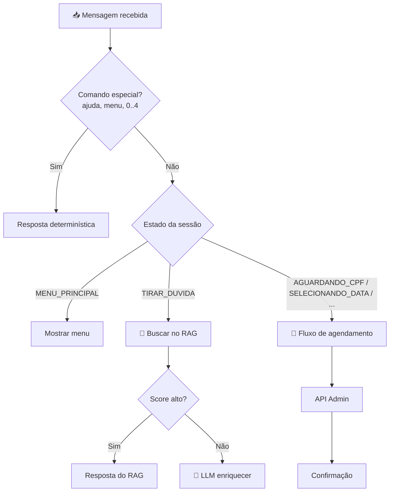
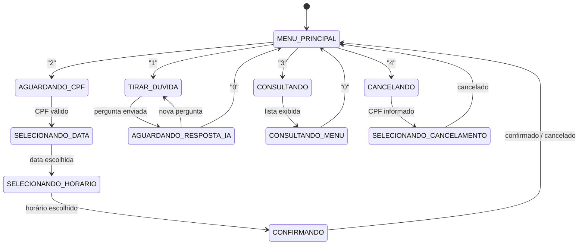
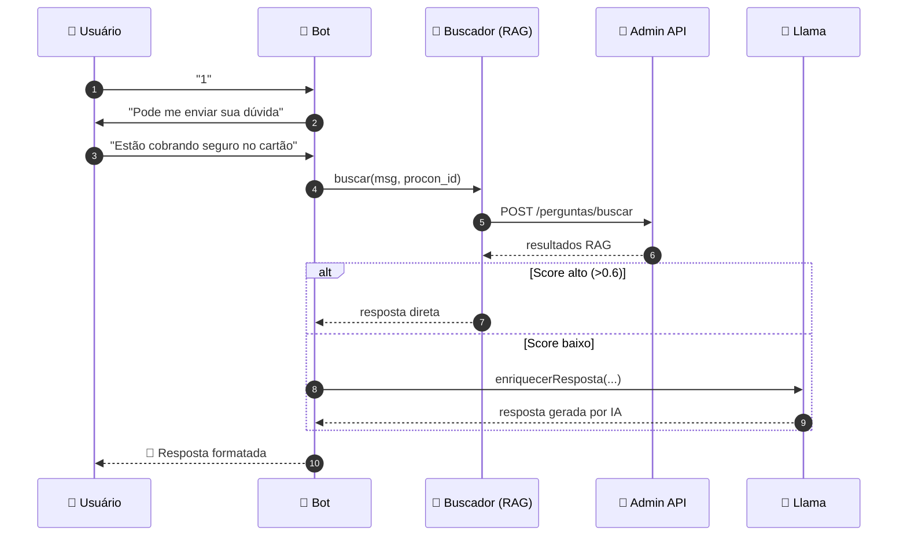
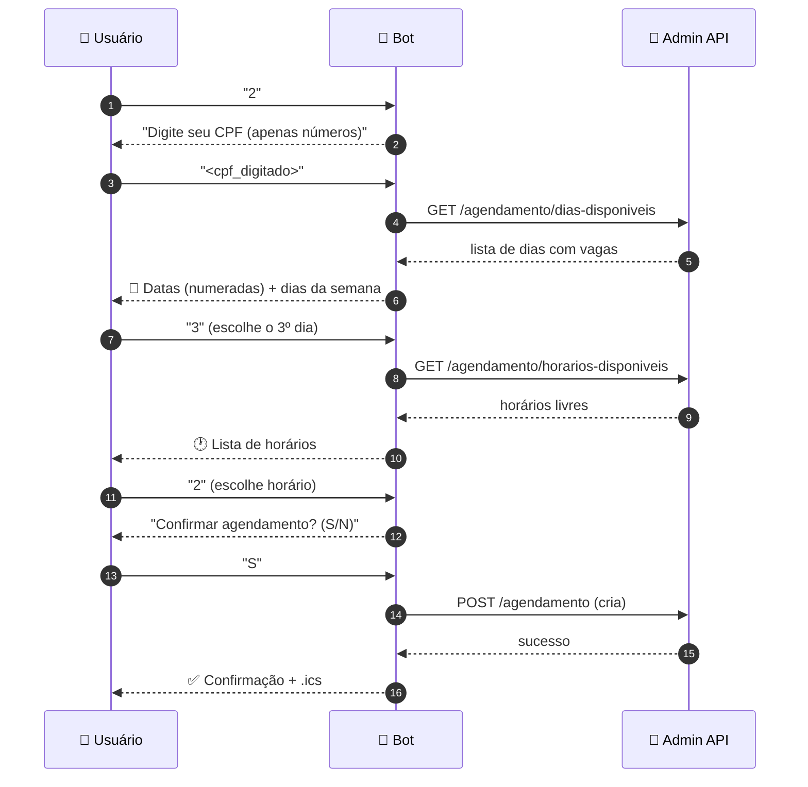

# 💬 Fluxo do Chatbot WhatsApp

> Documento técnico que descreve a integração do **ProconChatBot** com o WhatsApp, a máquina de estados de sessão, os fluxos de atendimento e como o bot decide entre RAG, LLM e respostas determinísticas.

🏠 [Voltar ao README](../README.md)


<br>

---

<br>

## 📋 Índice

- [Visão geral](#-visão-geral)
- [Integração com o WhatsApp](#-integração-com-o-whatsapp)
- [Identificação multi-unidade](#-identificação-multi-unidade)
- [Máquina de estados de sessão](#-máquina-de-estados-de-sessão)
- [Menu principal](#-menu-principal)
- [Fluxo: Tirar dúvidas](#-fluxo-tirar-dúvidas)
- [Fluxo: Agendamento](#-fluxo-agendamento)
- [Fluxo: Consultar agendamentos](#-fluxo-consultar-agendamentos)
- [Fluxo: Cancelar agendamento](#-fluxo-cancelar-agendamento)
- [Respostas determinísticas](#-respostas-determinísticas)
- [Casos sensíveis](#-casos-sensíveis-violência-saúde-mental)
- [Geração de calendário (.ics)](#-geração-de-calendário-ics)
- [Formato das mensagens](#-formato-das-mensagens)
- [Considerações para produção](#-considerações-para-produção)


<br>

---

<br>

## 🎯 Visão geral

O **ServiceChatbot** é o canal de atendimento ao cidadão. Ele:

1. Conecta-se ao WhatsApp via `whatsapp-web.js` *(QR Code → sessão persistida)*.
2. Identifica a unidade PROCON a partir do número que recebeu a mensagem.
3. Mantém **sessões em memória** por contato, com uma máquina de estados.
4. Decide entre **menu fixo**, **RAG (banco de perguntas)**, **LLM local** ou **respostas determinísticas** dependendo do contexto.
5. Pode criar/consultar/cancelar agendamentos via API Admin.



🔝 [Voltar ao topo](#-fluxo-do-chatbot-whatsapp)


<br>

---

<br>

## 📲 Integração com o WhatsApp

| Item | Detalhe |
|---|---|
| **Biblioteca** | [`whatsapp-web.js`](https://wwebjs.dev) |
| **Autenticação** | `LocalAuth` *(sessão persistida em disco)* |
| **Renderer** | Chromium via Puppeteer *(controla o WhatsApp Web)* |
| **Pasta de sessão** | `ServiceChatbot/backend/.wwebjs_auth/` *(não commitada)* |
| **Cache** | `.wwebjs_cache/` |
| **QR Code** | Exibido no terminal via `qrcode-terminal` no primeiro start |

### Eventos principais

```ts
client.on('qr',           qr      => qrcode.generate(qr, { small: true }));
client.on('authenticated', ()      => console.log('✅ Autenticado'));
client.on('ready',         ()      => console.log('🚀 Bot pronto'));
client.on('message',       msg     => handleMessage(msg));
```

> 📌 **RP01**: o uso de `whatsapp-web.js` é uma alternativa gratuita à WhatsApp Cloud API, válida para fins acadêmicos. Para produção, a recomendação é migrar para a Cloud API.

🔝 [Voltar ao topo](#-fluxo-do-chatbot-whatsapp)


<br>

---

<br>

## 🌎 Identificação multi-unidade

O bot pode atender **múltiplos PROCONs** em um único deploy. A identificação é feita pelo número que **recebeu** a mensagem:

```ts
const numeroDestino = msg.to; // "5512999991234@c.us"
const apenasDigitos = numeroDestino.replace(/\D/g, '');
const procon = await axios.get(
  `http://localhost:3002/procons/whatsapp/${apenasDigitos}`
);
session.proconInfo = procon.dados;
session.proconId = procon.dados.id;
```

A partir daí, todas as queries de pergunta, agendamento e feriado são feitas **filtrando por `procon_id`**.

🔝 [Voltar ao topo](#-fluxo-do-chatbot-whatsapp)


<br>

---

<br>

## 🧭 Máquina de estados de sessão

Cada `chatId` (contato do WhatsApp) possui uma sessão em memória:

```ts
type SessionStep =
  | "MENU_PRINCIPAL"
  | "AGUARDANDO_CPF"
  | "SELECIONANDO_DATA"
  | "SELECIONANDO_HORARIO"
  | "CONFIRMANDO"
  | "CONSULTANDO"
  | "CONSULTANDO_MENU"
  | "CANCELANDO"
  | "SELECIONANDO_CANCELAMENTO"
  | "TIRAR_DUVIDA"
  | "AGUARDANDO_RESPOSTA_IA"
  | "CONVERSANDO_IA";

interface Session {
  step: SessionStep;
  cpf?: string;
  dataSelecionada?: string;
  horarioSelecionado?: string;
  datasDisponiveis?: DiaDisponivel[];
  horariosDisponiveis?: string[];
  agendamentos?: Agendamento[];
  proconId?: number;
  proconInfo?: ProconInfo;
}
```

### Diagrama de transições



🔝 [Voltar ao topo](#-fluxo-do-chatbot-whatsapp)


<br>

---

<br>

## 📋 Menu principal

Apresentado no início da conversa e sempre que o usuário digita `0`, `menu` ou `opcoes`:

```text
📌 Menu Principal:

1️⃣ - Gostaria de tirar alguma dúvida com o procon?
2️⃣ - Agendar atendimento presencial
3️⃣ - Consultar meus agendamentos
4️⃣ - Cancelar agendamento
0️⃣ - Sair

💡 Digite o número da opção desejada.
```

🔝 [Voltar ao topo](#-fluxo-do-chatbot-whatsapp)


<br>

---

<br>

## ❓ Fluxo: Tirar dúvidas



### Decisão entre RAG e LLM

Implementada em `processMessage()` no [chatbot.service.ts](../ServiceChatbot/backend/src/services/chatbot.service.ts):

```ts
const resultadoRAG = await buscador.buscar(message, proconId);

if (resultadoRAG.metodo === "banco_dados" && resultadoRAG.resposta?.length > 10) {
  return formatarResposta(resultadoRAG, proconInfo);
}

// Fallback: resposta de ajuda
return formatarRespostaAjuda(proconInfo);
```

> O `llama.service.ts` atua principalmente com **respostas determinísticas** (saudações, ajuda institucional, casos sensíveis). A chamada efetiva ao Ollama é usada em fallback quando nada mais resolve.

🔝 [Voltar ao topo](#-fluxo-do-chatbot-whatsapp)


<br>

---

<br>

## 📅 Fluxo: Agendamento



### Validações aplicadas

- CPF é validado *(formato + dígito verificador)*.
- Datas: descartadas se for **feriado**, **fim de semana** ou **sem vaga**.
- Horários: respeitam `duracao_atendimento_minutos` e `vagas_por_horario` da unidade.
- Conflito: a Admin API rejeita agendamentos duplicados *(mesmo CPF, mesma data)*.

🔝 [Voltar ao topo](#-fluxo-do-chatbot-whatsapp)


<br>

---

<br>

## 🔍 Fluxo: Consultar agendamentos

```text
1. Usuário digita "3"
2. Bot pede o CPF
3. Bot chama GET /agendamento/buscar-por-cpf
4. Exibe a lista numerada com:
   • Data + horário
   • Status (PENDENTE, CONFIRMADO, COMPARECEU, FALTOU, CANCELADO)
   • Procon
5. Usuário pode digitar "0" para voltar ao menu
```

🔝 [Voltar ao topo](#-fluxo-do-chatbot-whatsapp)


<br>

---

<br>

## 🗑️ Fluxo: Cancelar agendamento

```text
1. Usuário digita "4"
2. Bot pede o CPF
3. Lista os agendamentos PENDENTES/CONFIRMADOS
4. Usuário escolhe o número correspondente
5. Bot pede confirmação (S/N)
6. Se "S" → DELETE /agendamento/:id
7. Confirmação ao usuário
```

🔝 [Voltar ao topo](#-fluxo-do-chatbot-whatsapp)


<br>

---

<br>

## 🎯 Respostas determinísticas

Para evitar custo de inferência e garantir consistência, várias respostas são **hard-coded** no `llama.service.ts`:

| Categoria | Trigger | Resposta |
|---|---|---|
| **Identidade** | "qual é o seu nome", "quem é você" | "Sou o assistente virtual do {Procon}…" |
| **Capacidades** | "o que você pode fazer", "suas funções" | Lista 5 capacidades. |
| **Agradecimento** | "obrigado", "valeu", "gratidão" | Despedida simpática. |
| **Saudações** | "oi", "olá", "bom dia", "boa tarde", "boa noite" | Saudação + menu. |
| **Status** | "tudo bem", "como vai" | "Tudo bem sim, obrigado!" |
| **Horário** | "horário", "abre", "funcionamento" | Horário da unidade. |
| **Endereço** | "endereço", "onde fica", "localização" | Endereço da unidade. |
| **Telefone** | "telefone", "contato", "ligar" | Telefone + WhatsApp. |
| **Documentos** | "documento", "rg", "cpf", "levar" | Lista de documentos. |
| **Estacionamento** | "estacionamento" | Recomenda ligar antes. |

🔝 [Voltar ao topo](#-fluxo-do-chatbot-whatsapp)


<br>

---

<br>

## 🚨 Casos sensíveis (violência, saúde mental)

O bot **detecta palavras-gatilho** e redireciona imediatamente para canais especializados, sem tentar responder com IA:

### Violência / agressão

Triggers: `bateram`, `agressão`, `violência`, `espancaram`, `socorro`, `urgente`

```text
⚠️ ATENDIMENTO DE URGÊNCIA

Sinto muito pelo que você está passando. Se você está em situação
de violência ou risco imediato, ligue para:

🚨 190  - Polícia Militar (emergência)
🚨 180  - Central de Atendimento à Mulher
🚨 100  - Disque Direitos Humanos
```

### Saúde mental

Triggers: `depressão`, `ansiedade`, `suicídio`, `triste`, `desespero`

```text
💙 Apoio Emocional

📞 CVV: 188 (24 horas, gratuito)
🌐 www.cvv.org.br - chat online
```

> ⚠️ **Importante:** o bot **não** tenta substituir profissionais. Apenas redireciona para serviços oficiais.

🔝 [Voltar ao topo](#-fluxo-do-chatbot-whatsapp)


<br>

---

<br>

## 📆 Geração de calendário (.ics)

Após confirmar um agendamento, o bot pode enviar um **arquivo `.ics`** anexado para o usuário adicionar à agenda do celular:

```ts
import { gerarMensagemCalendario } from "../services/ics.service";

const ics = await gerarMensagemCalendario({
  proconInfo,
  data: "2026-06-10",
  horario: "09:30",
  nome: "Maria da Silva",
});

await msg.reply(MessageMedia.fromFilePath(ics.filePath));
```

A biblioteca `ical-generator` produz um arquivo padrão **iCalendar (RFC 5545)** compatível com Google Calendar, Apple Calendar e Outlook.

🔝 [Voltar ao topo](#-fluxo-do-chatbot-whatsapp)


<br>

---

<br>

## 🎨 Formato das mensagens

O WhatsApp suporta um Markdown reduzido. Convenções adotadas:

| Marca | Efeito | Uso |
|---|---|---|
| `*texto*` | **Negrito** | Títulos, ênfase |
| `_texto_` | _Itálico_ | Observações |
| `~texto~` | ~~Riscado~~ | Avisos |
| ` ```texto``` ` | `Mono` | Comandos |

**Exemplo de resposta padronizada:**

```text
📌 *Resposta do PROCON*

Você tem direito à devolução em dobro do valor cobrado indevidamente.

📚 *Base legal:* Art. 42, CDC · Art. 6º, III, CDC

📋 *Documentos necessários:*
• RG e CPF
• Faturas com a cobrança
• Comprovantes de pagamento

ℹ️ *Observação:* Os casos podem variar conforme a situação.

🔙 Digite *0* para voltar ao menu principal.
```

🔝 [Voltar ao topo](#-fluxo-do-chatbot-whatsapp)


<br>

---

<br>

## 🚀 Considerações para produção

| Tópico | Recomendação |
|---|---|
| **Plataforma** | Migrar `whatsapp-web.js` → **WhatsApp Cloud API** *(oficial, Meta)*. |
| **Sessões** | Mover armazenamento em memória → **Redis** (persistência + multi-instância). |
| **Rate limiting** | Adicionar limites por contato para evitar abuso. |
| **Observabilidade** | Logs estruturados *(pino/winston)* + métricas *(Prometheus)*. |
| **Filas** | Usar **BullMQ** para processar mensagens assíncronas em pico. |
| **Idempotência** | Garantir que reenvios do WhatsApp não dupliquem agendamentos. |
| **LGPD** | Mascarar CPFs nos logs, oferecer "esquecer meus dados". |
| **Identificação de IA** | Sempre que o LLM enriquecer a resposta, deixar explícito *(RNF05)*. |

🔝 [Voltar ao topo](#-fluxo-do-chatbot-whatsapp)


<br>

---

<br>

## 🔗 Veja também

- [📘 README — Documento central](../README.md)
- [📐 Arquitetura detalhada](./ARCHITECTURE.md)
- [⚙️ Guia de instalação](./INSTALLATION.md)
- [🔌 Referência de API](./API.md)
- [⚛️ Documentação do frontend](./FRONTEND.md)
- [🧠 Sistema RAG](./RAG.md)

---

<p align="center"><sub>Documento mantido pela equipe Azimuth do 6º DSM — Fatec / Jacareí 2026.</sub></p>
