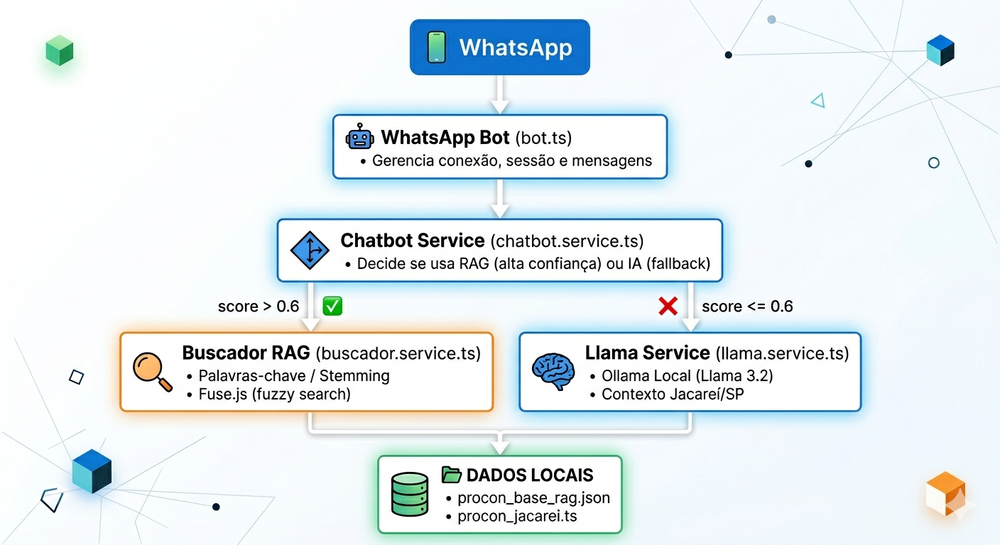

# 🤖 Procon Chatbot — Backend

> Sistema de chatbot inteligente para o **Procon de Jacareí/SP** com RAG (Retrieval-Augmented Generation), integração com WhatsApp e IA local via Ollama/Llama.

---

## 📋 Índice

- [Visão Geral](#visão-geral)
- [Arquitetura](#arquitetura)
- [Pré-requisitos](#pré-requisitos)
- [Instalação](#instalação)
- [Configuração](#configuração)
- [Comandos](#comandos)
- [Estrutura do Projeto](#estrutura-do-projeto)
- [Fluxo de Trabalho](#fluxo-de-trabalho)
- [APIs](#apis)
- [Testes](#testes)
- [Troubleshooting](#troubleshooting)
- [Contribuição](#contribuição)
- [Licença](#licença)

---

## 🎯 Visão Geral

O Procon Chatbot é uma solução completa de atendimento automatizado para o Procon de Jacareí/SP. Ele responde perguntas de consumidores via WhatsApp utilizando uma base de dados local (RAG) e, quando necessário, recorre a uma IA local (Llama) para respostas mais elaboradas.

**Principais funcionalidades:**

- ✅ Integração nativa com WhatsApp via `whatsapp-web.js`
- ✅ RAG com busca semântica por palavras-chave + Fuse.js
- ✅ Fallback para IA local (Ollama + Llama 3.2) quando o RAG não tem resposta confiante
- ✅ Base de dados jurídica com artigos do CDC
- ✅ APIs REST para integração externa
- ✅ Totalmente offline — sem dependência de APIs pagas

---

## 🏗️ Arquitetura



---

## 📦 Pré-requisitos

| Ferramenta | Versão mínima | Verificar com |
|---|---|---|
| Node.js | 18+ | `node --version` |
| npm | 9+ | `npm --version` |
| Ollama *(opcional)* | latest | `ollama --version` |

### Instalar Ollama (para IA local)

```bash
# Windows — baixe em: https://ollama.com/download/windows

# Linux / macOS
curl -fsSL https://ollama.com/install.sh | sh

# Baixar o modelo Llama 3.2
ollama pull llama3.2:latest
```

---

## 🚀 Instalação

```bash
# 1. Clone o repositório
git clone <url-do-repositorio>
cd backend

# 2. Instale as dependências
npm install

# 3. Configure as variáveis de ambiente
cp .env.example .env   # se existir, ou crie manualmente

# 4. Execute em modo desenvolvimento
npm run dev
```

---

## ⚙️ Configuração

### Variáveis de Ambiente (`.env`)

```env
# Servidor
PORT=3000
CHATBOT_PORT=3001

# Ollama (IA Local)
OLLAMA_URL=http://localhost:11434
OLLAMA_MODEL=llama3.2:latest

# WhatsApp
WHATSAPP_SESSION_PATH=./session-data
```

---

## 📝 Comandos

### Desenvolvimento

| Comando | Descrição |
|---|---|
| `npm run dev` | Roda o servidor principal (API + WhatsApp) |
| `npm run dev:cli` | Roda apenas o CLI de teste (sem WhatsApp) |

### Produção

| Comando | Descrição |
|---|---|
| `npm run build` | Compila TypeScript para JavaScript |
| `npm run start` | Roda o servidor compilado |
| `npm run start:cli` | Roda o CLI compilado |

### Testes

| Comando | Descrição |
|---|---|
| `npm test` | Roda testes do buscador RAG |
| `npm run test:all` | Roda todos os testes |
| `npm run test:watch` | Modo watch (desenvolvimento) |

### Utilitários

| Comando | Descrição |
|---|---|
| `npm run clean` | Remove a pasta `dist/` |
| `npm run type-check` | Verifica tipos TypeScript sem compilar |

---

## 📂 Estrutura do Projeto

```
backend/
├── src/
│   ├── cli/
│   │   └── test.ts                 # CLI interativo para testes
│   ├── controllers/
│   │   ├── chatbot.controller.ts   # Controlador do Chatbot API
│   │   └── rag.controller.ts       # Controlador da RAG API
│   ├── data/
│   │   ├── procon_base_rag.json    # Base de dados principal
│   │   └── procon_jacarei.ts       # Informações do Procon Jacareí
│   ├── middlewares/
│   │   └── logger.middleware.ts    # Middleware de logging
│   ├── routes/
│   │   ├── chatbot.routes.ts       # Rotas do Chatbot API
│   │   └── rag.routes.ts           # Rotas da RAG API
│   ├── services/
│   │   ├── buscador.service.ts     # Buscador RAG (palavras-chave + Fuse.js)
│   │   ├── chatbot.service.ts      # Lógica principal do chatbot
│   │   └── llama.service.ts        # Integração com Ollama (IA local)
│   ├── types/
│   │   └── procon.types.ts         # Tipos TypeScript
│   ├── whatsapp/
│   │   └── bot.ts                  # Bot do WhatsApp
│   ├── __tests__/
│   │   ├── buscador.test.ts        # Testes do buscador RAG
│   │   └── llama.test.ts           # Testes do Llama Service
│   └── server.ts                   # Ponto de entrada (API + WhatsApp)
├── .gitignore
├── package.json
├── tsconfig.json
└── README.md
```

---

## 🔄 Fluxo de Trabalho

### 1. Mensagem do WhatsApp

```
Usuário envia mensagem
        ↓
WhatsApp Bot recebe a mensagem
        ↓
Chama chatbot.service.processMessage()
        ↓
Retorna resposta formatada ao usuário
```

### 2. Processamento da Mensagem

```typescript
// chatbot.service.ts
export async function processMessage(message: string): Promise<string> {
  // 1. Busca no RAG
  const resultado = buscador.buscar(message);

  // 2. Confiança ALTA (score > 0.6) → usa RAG diretamente
  if (resultado.confianca === "Alta" && resultado.score > 0.6) {
    return formatarRespostaRAG(resultado);
  }

  // 3. Confiança BAIXA → aciona IA local (Llama)
  const respostaIA = await llamaService.enriquecerResposta(message, resultado);
  return respostaIA;
}
```

### 3. Como o RAG funciona

```typescript
// buscador.service.ts — Estratégias de busca em ordem de prioridade

// 1. Palavras-chave com stemming
//    - Remove stopwords (a, o, de, para...)
//    - Radicalização (cobrança → cobr, seguro → segur)
//    - Pontua cada item com base em matches

// 2. Busca difusa (Fuse.js)
//    - Tolerante a erros de digitação
//    - Peso maior para perguntas e temas

// 3. Fallback
//    - Retorna o item mais genérico (ID 1)
//    - Confiança: "Baixa"
```

### 4. Formato da Resposta

```
📌 *Resposta do Procon*

📚 *Base legal:* Art. 6º, III, CDC · Art. 42, CDC

📋 *Documentos necessários:*
• RG e CPF
• Faturas com a cobrança
• Comprovantes de pagamento

ℹ️ *Observação:* Os casos podem variar conforme a situação.

🔗 *Fonte:* Procon Jacareí — Banco de Dados Oficial
📞 Dúvidas? Ligue (12) 3955-1234
```

---

## 🌐 APIs

### API RAG — Porta 3000

| Endpoint | Método | Descrição | Body / Params |
|---|---|---|---|
| `/api/perguntar` | POST | Consultar o RAG | `{ "pergunta": "texto", "usarLlama": true }` |
| `/api/temas` | GET | Listar todos os temas | — |
| `/api/tema/:id` | GET | Buscar tema por ID | `id` (1–9) |
| `/api/stats` | GET | Estatísticas | — |
| `/api/health` | GET | Health check | — |

### API Chatbot — Porta 3001

| Endpoint | Método | Descrição | Body / Params |
|---|---|---|---|
| `/api/chat` | POST | Enviar mensagem ao chatbot | `{ "mensagem": "texto", "historico": [] }` |
| `/api/tema/:id` | GET | Buscar tema por ID | `id` (1–9) |
| `/api/stats` | GET | Estatísticas | — |

### Exemplos de Requisição

```bash
# Perguntar ao RAG
curl -X POST http://localhost:3000/api/perguntar \
  -H "Content-Type: application/json" \
  -d '{"pergunta":"Estão cobrando um seguro no meu cartão"}'

# Perguntar ao Chatbot
curl -X POST http://localhost:3001/api/chat \
  -H "Content-Type: application/json" \
  -d '{"mensagem":"Como cancelar meu plano de telefone?"}'

# Listar temas disponíveis
curl http://localhost:3000/api/temas
```

---

## 🧪 Testes

```bash
# Teste do buscador RAG
npm test

# Todos os testes
npm run test:all

# Modo watch (desenvolvimento)
npm run test:watch
```

### Casos de teste cobertos

```typescript
// buscador.test.ts
- Deve encontrar "seguro no cartão"       → ID 1
- Deve encontrar "empréstimo quitado"     → ID 2
- Deve encontrar "RMC/RCC no benefício"   → ID 6
- Deve retornar fallback para pergunta desconhecida
```

---

## 🐛 Troubleshooting

### WhatsApp não conecta

```bash
# Limpar sessão e tentar novamente
rm -rf session-data/ .wwebjs_auth/ .wwebjs_cache/

# Windows
rmdir /s /q session-data .wwebjs_auth .wwebjs_cache

# Reiniciar
npm run dev
```

### Ollama não responde

```bash
# Verificar se está rodando
curl http://localhost:11434/api/tags

# Se não estiver, iniciar
ollama serve

# Verificar modelos instalados
ollama list

# Baixar modelo se necessário
ollama pull llama3.2:latest
```

### Erro de compilação TypeScript

```bash
# Verificar tipos
npm run type-check

# Limpar e recompilar
npm run clean
npm run build
```

### Porta já em uso

```bash
# Verificar processo na porta 3000
lsof -i :3000          # Linux/macOS
netstat -ano | findstr :3000   # Windows

# Matar o processo ou alterar a porta no .env
```

### Git mostrando arquivos do WhatsApp

```bash
# Remover arquivos do cache do Git
git rm -r --cached .wwebjs_auth/ .wwebjs_cache/ session-data/
git commit -m "chore: remove arquivos do WhatsApp do tracking"
```

---

## 🤝 Contribuição

### Padrão de Commits

```
feat:     nova funcionalidade
fix:      correção de bug
docs:     documentação
style:    formatação
refactor: refatoração
test:     testes
chore:    manutenção
```

### Fluxo de Trabalho

```bash
# 1. Criar branch
git checkout -b feature/nova-feature

# 2. Desenvolver e testar
npm run dev
npm test

# 3. Commitar
git add .
git commit -m "feat: descrição da feature"

# 4. Push e Pull Request
git push origin feature/nova-feature
```

### Adicionar Nova Pergunta ao RAG

1. Abra `src/data/procon_base_rag.json`
2. Adicione um novo objeto seguindo o padrão:

```json
{
  "id": 10,
  "tema": "nome_do_tema",
  "pergunta": "Pergunta típica do usuário",
  "resposta": "Resposta oficial do Procon",
  "base_legal": ["Art. X, CDC", "Art. Y, CDC"],
  "documentos": ["RG", "CPF", "Comprovante"],
  "observacao": "Observação importante sobre o caso"
}
```

3. Reinicie o servidor.

### Debug

```bash
# Logs detalhados do WhatsApp (Puppeteer)
DEBUG=puppeteer* npm run dev

# Logs do RAG aparecem no console
# Procure por: 📊 Resultado RAG
```

---


<div align="center">

Desenvolvido para os cidadãos do estado de São Paulo

</div>
