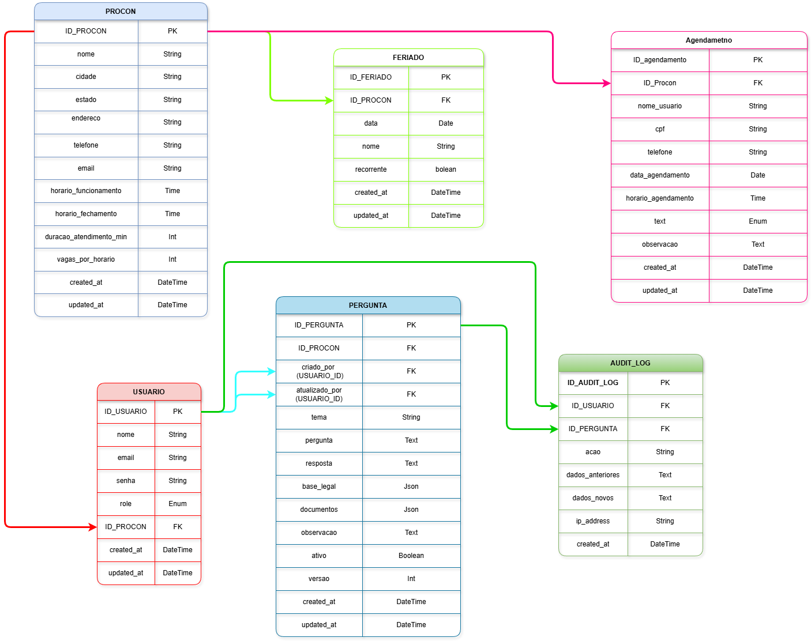

# 🗄️ Documentação do Esquema de Dados (Database Schema)

Esta documentação detalha a estrutura de dados do **ProconChatBot**, focando nas responsabilidades de cada tabela e nas regras de integridade.

## 🗺️ Diagrama Entidade-Relacionamento (ER)


> *Nota: Caso o diagrama acima não carregue, consulte o arquivo SchemaDb.drawio na pasta de docs.*

---

## 🏛️ Dicionário de Dados

### 1. Unidades PROCON (`procon`)
Centraliza as configurações das unidades físicas. 
* **Destaque:** Os campos `duracao_atendimento_minutos` e `vagas_por_horario` são consumidos pelo motor de agendamento para calcular a disponibilidade em tempo real.

### 2. Base de Conhecimento RAG (`pergunta`)
Esta é a tabela principal do motor de IA.
* **Busca Semântica:** O campo `embedding` utiliza o tipo `VECTOR` do PostgreSQL para permitir buscas por similaridade.
* **Versionamento:** O campo `versao` permite manter um histórico de respostas oficiais, garantindo que o chatbot não utilize informações defasadas.
* **Campos JSON:** `base_legal` e `documentos` permitem armazenar arrays flexíveis de referências jurídicas sem engessar o esquema.

### 3. Gestão de Agendamentos (`agendamento`)
Registra a interação do cidadão com a unidade física.
* **Índice Composto:** Utilizamos o índice `idx_agendamento_vagas` para garantir que a verificação de disponibilidade seja instantânea, mesmo com milhares de registros.

### 4. Controle de Acesso e Auditoria (`usuario` & `audit_log`)
* **Roles:** O sistema implementa RBAC (*Role-Based Access Control*) com níveis que variam de `FUNCIONARIO` a `DEV`.
* **Auditoria Total:** Toda alteração em perguntas da base RAG gera um log em `audit_log`, salvando o estado anterior e o novo (`JSON`), permitindo *rollback* manual se necessário.

---

## ⚙️ Regras de Integridade e Performance

### Índices Estratégicos
Para garantir que o Chatbot responda em milissegundos, aplicamos:
* **Busca Semântica:** Índice IVFFlat ou HNSW no campo `embedding` (configurado via Migration).
* **Bloqueios de Agenda:** Busca otimizada unindo `feriado` e `agendamento` por `procon_id`.

### Configuração de Ambiente (Docker)
Para subir o banco localmente com suporte a vetores:
```bash
docker run -d --name postgres-procon \
  -e POSTGRES_USER=procon_user \
  -e POSTGRES_PASSWORD=procon_password \
  -e POSTGRES_DB=procon_db \
  -p 5432:5432 \
  ankane/pgvector:latest
```

---

## 🛠️ Manutenção (Prisma)

Sempre que houver alterações no arquivo `schema.prisma`, utilize os comandos abaixo para sincronizar o banco de dados:

```bash
# Gerar uma nova migration e aplicar ao banco de dados
npx prisma migrate dev --name nome_da_alteracao

# Abrir o Prisma Studio para visualizar os dados (GUI)
npx prisma studio
```

---
