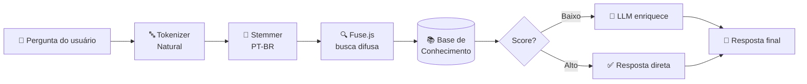

<h1 align="center">📍 Sprint 01 — ProconChatBot</h1>

  
  
  

  <b>🗓️ 09/03/2026 — 25/03/2026</b>

  <a href="#-objetivo">Objetivo</a> ·
  <a href="#-backlog">Backlog</a> ·
  <a href="#-burndown">Burndown</a> ·
  <a href="#-kanban">Kanban</a> ·
  <a href="#-arquitetura-rag">Arquitetura RAG</a> ·
  <a href="#-sprint-review">Review</a>

  🏠 <a href="../README.md">Voltar ao README</a> ·
  📘 <a href="./ARCHITECTURE.md">Arquitetura</a> ·
  ➡️ <a href="./sprint2.md">Sprint 02</a>

 

---

 

## 🎯 Objetivo

Os objetivos desta sprint foram centrados na implementação do **Core Engine** do chatbot:

- 🧠 Estruturar o sistema de **busca semântica (RAG)**.
- 🗣️ Processar linguagem natural em português com a biblioteca **Natural** *(stemming + tokenização)*.
- 🦙 Integração inicial com **modelo de linguagem (LLM)** via `Axios` para validação técnica.
- ✅ Garantir cobertura de testes automatizados sem custos de API durante o dev.

🔝 [Voltar ao topo](#top)

 

---

 

## 🚧 Backlog

| Tarefa | Status |
|:---|:---:|
| Modelagem da Base de Conhecimento (JSON Procon) | ✅ |
| Implementação do `BuscadorService` (Fuse.js) | ✅ |
| Configuração de Stemming e Tokenização (Natural) | ✅ |
| Integração com API de LLM Open Source (Llama / LlamaCloud) | ✅ |
| Criação de Testes Automatizados (Buscador / LLM) | ✅ |
| Documentação Técnica do Sistema RAG | ✅ |

🔝 [Voltar ao topo](#top)

 

---

 

## 📇 Burndown

Nesta sprint, o time focou na estabilidade do algoritmo de busca e na redução de falsos positivos no motor de recuperação semântica. O gráfico abaixo representa a queima de **40 Story Points**:

🔝 [Voltar ao topo](#top)

 

---

 

## 📝 Kanban

🔝 [Voltar ao topo](#top)

 

---

 

## 🏗️ Arquitetura RAG

A Sprint 01 entregou o **motor de busca semântica** que fundamenta as respostas do chatbot:

> 📘 Para detalhes técnicos completos, veja [docs/ARCHITECTURE.md](./ARCHITECTURE.md).

🔝 [Voltar ao topo](#top)

 

---

 

## 🎬 Sprint Review

### ✅ O que funcionou bem

| Ponto | Detalhe |
|---|---|
| 🎯 **Eficiência do Motor RAG** | A combinação de stemming com busca difusa *(Fuse.js)* apresentou alta precisão na recuperação de leis específicas do PROCON. |
| 🧪 **Ciclo de testes automatizados** | O uso de `TSX` e do driver nativo do Node permitiram validar o comportamento da IA **sem custos extras de API** durante o dev. |
| 👥 **Organização da equipe** | Discord para troca rápida de logs de erro e GitHub Projects para centralização do backlog técnico. |

### ⚠️ Pontos a melhorar

| Ponto | Ação na próxima sprint |
|---|---|
| ⏱️ **Latência de resposta** | A LLM apresentou picos de latência em horários de alta demanda → avaliar cache ou modelos locais na **Sprint 02**. |
| 🗣️ **Variações linguísticas** | O motor de busca precisa de ajustes para entender gírias e abreviações informais dos usuários de Jacareí. |

🔝 [Voltar ao topo](#top)

 

---

 

  ⬅️ <a href="../README.md">Voltar ao README</a> · 
  <a href="./sprint2.md">Próxima: Sprint 02 ➡️</a>

Documento mantido pela equipe Azimuth do 6º DSM — Fatec / Jacareí 2026.

