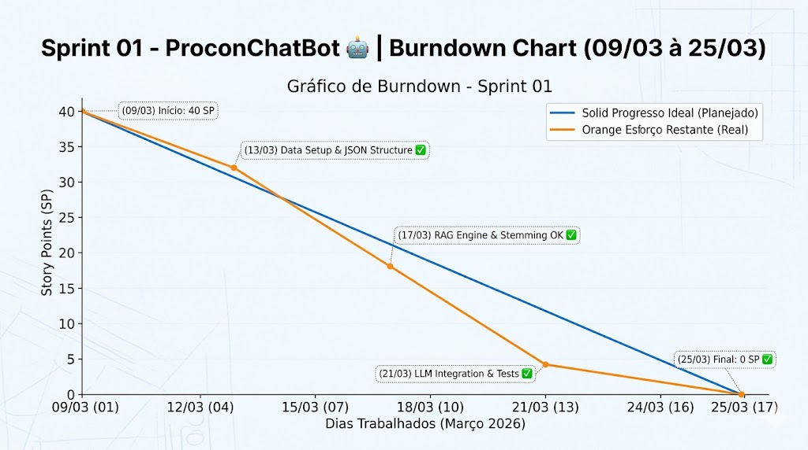
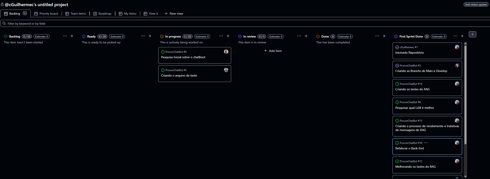

# 📍 Sprint 01 - ProconChatBot 📍

**🗓️ 09/03/2026 à 25/03/2026 🗓️**

<a href="#objetivo">Objetivo da Sprint</a> | 
<a href="#backlog">Backlog da Sprint</a> | 
<a href="#burndown">Burndown</a> | 
<a href="#arquitetura">Arquitetura RAG</a> | 
<a href="#kanban">Kanban</a> | 
<a href="#review">Sprint Review</a>

 

🏠 [Voltar para home](../README.md)

---

## 🤝 Objetivo da Sprint

Os objetivos desta sprint foram centrados na implementação do **Core Engine** do chatbot. Focamos na estruturação do sistema de busca semântica (RAG), processamento de linguagem natural em português (NLP) utilizando a biblioteca `Natural` e a integração inicial com o modelo de linguagem (LLM) via `Axios` para validação técnica da solução.

---

## 🚧 Sprint Backlog

| Tarefa | Status |
|:---|:---:|
| Modelagem da Base de Conhecimento (JSON Procon) | ✅ |
| Implementação do BuscadorService (Fuse.js) | ✅ |
| Configuração de Stemming e Tokenização (Natural) | ✅ |
| Integração com API de LLM Open Source (Llama/LlamaCloud) | ✅ |
| Criação de Testes Automatizados (Buscador/LLM) | ✅ |
| Documentação Técnica do Sistema RAG | ✅ |

---

## 📇 Burndown Sprint 01

Nesta sprint, o time focou na estabilidade do algoritmo de busca e na redução de falsos positivos no motor de busca. Abaixo, o gráfico representativo da queima de **40 Story Points**:

---
## 📝 Kanban

---

## 🎬 Sprint Review

#### O que funcionou bem?
* **Eficiência do Motor RAG:** A combinação de Stemming com busca difusa (Fuse.js) apresentou alta precisão na recuperação de leis específicas do PROCON.
* **Ciclo de Testes Automatizados:** O uso de `TSX` e o driver nativo do Node permitiram validar o comportamento da IA sem custos extras de API durante o dev.
* **Organização da Equipe:** Uso do Discord para troca rápida de logs de erro e GitHub Projects para centralização do backlog técnico.

#### Pontos a melhorar!
* **Latência de Resposta:** A LLM apresentou picos de latência em horários de alta demanda; será necessário avaliar cache ou modelos locais na Sprint 2.
* **Variações Linguísticas:** O motor de busca ainda precisa de ajustes para entender gírias ou abreviações muito informais dos usuários de Jacareí.

---